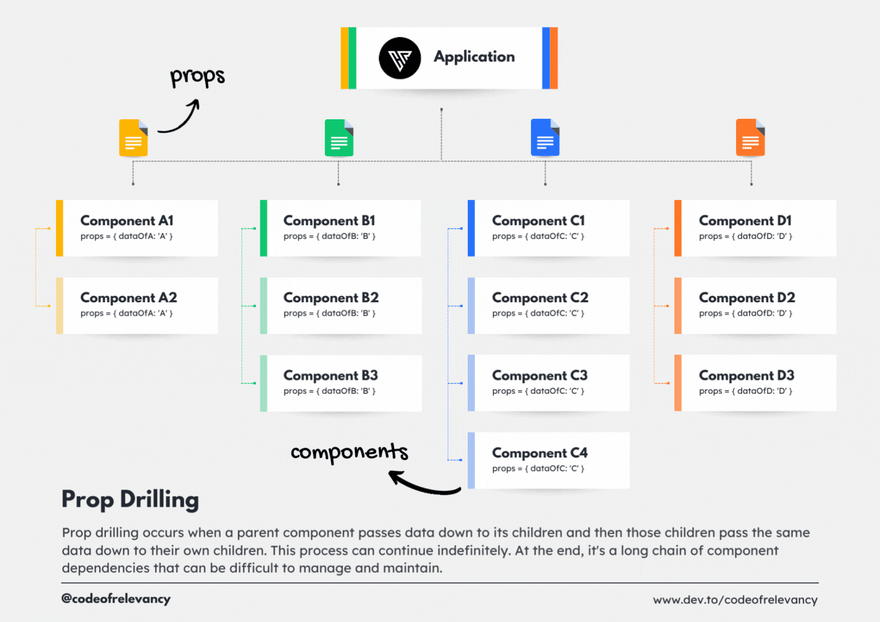
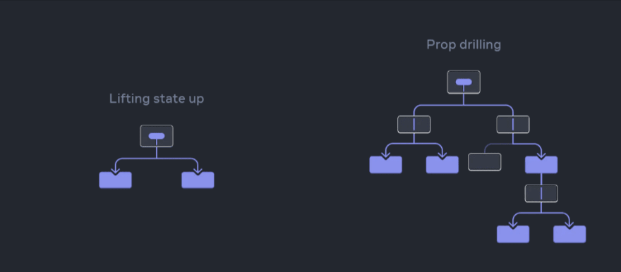

# Prop Drilling

## What is prop drilling

Prop drilling is known as "threading props" or "component chaining", refers to the process of passing data from a parent component down to nested child component through props.

Props drilling occurs when a prop needs to be passed through several layers of nested componenets to reach a deeply nested child component that actually needs the props. Each intermediary component in the hierachy has to pass the prop down, even if it does not use the prop itself.

Consider a scenerio where you have a top-level component that fetches data from an API and needs to pass this data down to multiple nested child components.

Instead of directly passing the data to each child component, you pass it through eah intermediary component in the hierarchy until it reaches the desired chil component. This passing of props through multiple levels of components is what prop drilling entails.

## Understanding Prop Drilling
Prop Drilling is when you pass props down multiple levels of components. In this project, we pass the addTask function from the App component to TodoForm, and the deleteTask function from App to TodoItem through TodoList.
## Understanding the State Problem
In this simple app, managing state directly in the App component works well. However, in a larger application, prop drilling can become cumbersome when you have to pass data through many layers of components, especially when only a few components actually need the data.

Next Steps: This sets the foundation for Week 2, where we will introduce useContext to solve the prop drilling problem and manage state in a cleaner way.

### Key Concepts Learned Prop drilling:
Component-Based Architecture: Breaking a UI into reusable components.
Props and State: Using props to pass data, and state to manage data inside a component.
Prop Drilling: Passing props through multiple components to share data between them.
State Problem: The challenge of prop drilling when the app scales up.